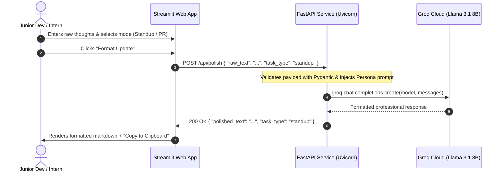

# Project Planner: The Standup & PR Polish Agent

> **Goal:** Build an open-source, AI-powered developer utility that turns raw, informal brain-dumps into crisp, confident daily standup updates and GitHub Pull Request descriptions.

---

## 1. Problem Statement

Interns and junior developers often suffer from imposter syndrome and communication anxiety in professional engineering settings. Preparing daily stand-up messages and Pull Request (PR) descriptions often takes excessive time due to overthinking tone, formatting, and phrasing.

### The Pain Points
- **Tone Anxiety:** Overly apologetic language ("sorry if this is wrong", "css is still weird so I didn't push") diminishes confidence and clarity.
- **Lost Context:** Crucial testing steps or blockers get buried in rambling or informal notes.
- **Time Sink:** Up to 30–45 minutes wasted every day drafting simple status updates.

### The Solution
A lightweight, lightning-fast Python application acting as an automated, encouraging "Senior Developer" partner. The user drops in raw thoughts, selects a format (**Standup** or **PR Description**), and receives an instant, professional, structured update ready to paste into Slack, Teams, or GitHub.

---

## 2. Technology Stack & Architecture (Streamlit + FastAPI)

### Tech Stack Matrix
| Component | Technology | Rationale |
| :--- | :--- | :--- |
| **Frontend UI** | Streamlit (Python) | Rapid, beautiful data/AI UI with native session state, markdown rendering, tabs, and one-click copy buttons. |
| **Backend API** | FastAPI (Python) + Uvicorn | High-performance asynchronous API, auto-generated OpenAPI documentation, Pydantic type validation. |
| **AI Inference** | Groq Python SDK (`llama-3.1-8b-instant`) | Ultra-fast inference (<500ms), open weights, free tier availability, zero vendor lock-in. |
| **Validation & Schema** | Pydantic v2 | Strict request/response contracts (`PolishRequest`, `PolishResponse`). |
| **HTTP Client** | `httpx` or `requests` | Lightweight client within Streamlit to call FastAPI backend. |
| **Environment Management** | `python-dotenv` | Secure handling of secrets and config. |
| **Deployment / Hosting** | Streamlit Community Cloud (UI) + Render / Railway (FastAPI) | Free-tier compatible, instant deployment directly from GitHub. |

### Architecture & Data Flow

---

## 3. Project Phases & Granular Subtasks

### Phase 1: Environment & FastAPI Backend Setup
- [x] **Subtask 1.1: Project Directory Structure & Virtual Env**
  - Create directory layout (`backend/app`, `frontend/`, `venv/`).
  - Set up Python virtual environment (`python -m venv venv`).
- [x] **Subtask 1.2: Dependencies & Configuration**
  - In `backend/requirements.txt`: `fastapi`, `uvicorn[standard]`, `pydantic`, `groq`, `python-dotenv`.
  - In `frontend/requirements.txt`: `streamlit`, `httpx`, `python-dotenv`.
  - Configured `.env.example` and `.gitignore` (ignoring `venv/`, `__pycache__/`, `.env`).
- [x] **Subtask 1.3: Pydantic Data Models (`backend/app/schemas.py`)**
  - Defined `TaskType` enum: `"standup"`, `"pr"`.
  - Defined `PolishRequest`: `raw_text: str` (with min length validation), `task_type: TaskType`.
  - Defined `PolishResponse`: `polished_text: str`, `task_type: TaskType`, `model_used: str`.
- [x] **Subtask 1.4: Prompt Engineering (`backend/app/prompts.py`)**
  - **Standup Persona:** Converts notes into: **Yesterday**, **Today**, **Blockers**, stripping apologetic phrases.
  - **Pull Request Persona:** Structures notes into: **Summary of Changes**, **Impact**, and **Testing Steps**.
- [x] **Subtask 1.5: Groq Integration Service (`backend/app/services.py`)**
  - Initialized `Groq` client targeting `llama-3.1-8b-instant`.
- [x] **Subtask 1.6: FastAPI Routes & Error Handling (`backend/app/main.py`)**
  - Configured `CORSMiddleware`.
  - Added health check: `GET /health`.
  - Implemented `POST /api/polish` with error mapping for Groq API / status codes.
  - Added unit test suite in `backend/test_main.py` (passed 100%).

---

### Phase 2: Streamlit Frontend Development
- [x] **Subtask 2.1: Page Config & Theme Styling**
  - Configured page settings: `st.set_page_config(page_title="Standup & PR Polish Agent", page_icon="🚀", layout="wide")`.
  - Custom glassmorphic CSS styling in `frontend/styles.py` with custom fonts, hero badges, and card styles.
- [x] **Subtask 2.2: Mode Selection & Input Area**
  - Segmented radio toggle: **Daily Standup 📋** vs. **Pull Request Description 🔀**.
  - Large text area for developer notes with character count and clean layout.
  - "Load Chaotic Example" button to load real sample notes with one click.
  - Clear / reset button.
- [x] **Subtask 2.3: API Client & Execution Flow**
  - Created `frontend/api_client.py` using `httpx` connecting to `POST /api/polish`.
  - Health check polling for the FastAPI backend with live status indicator in the sidebar.
  - Spinner animation while Gemini processes the note.
- [x] **Subtask 2.4: Results Display & Clipboard Integration**
  - Tabbed results display:
    - **Formatted Preview:** Rich markdown rendering of the senior dev output.
    - **One-Click Copy:** Native copy button via markdown code block.
    - **Before vs After:** Side-by-side diff comparison between raw and polished notes.

---

### Phase 3: Integration, Local Testing & Deployment
- [x] **Subtask 3.1: Concurrent Local Testing**
  - Run FastAPI: `uvicorn app.main:app --port 8000` (Healthy, `gemini_configured: True`).
  - Run Streamlit: `streamlit run frontend/app.py --server.port 8502` (Live preview tested).
  - Verified full end-to-end integration: `POST /api/polish` -> Gemini (`gemini-2.5-flash`) -> Structured output.
  - Verified error tolerance and retry logic for upstream API demand spikes.
- [x] **Subtask 3.2: FastAPI Deployment Configuration (Render / Railway / Fly.io)**
  - Created `backend/Procfile` with `web: uvicorn app.main:app --host 0.0.0.0 --port $PORT`.
  - Configured environment schema (`GEMINI_API_KEY`, `PORT`).
  - Verified public CORS middleware allows any web client.
- [x] **Subtask 3.3: Streamlit Deployment Configuration (Streamlit Community Cloud)**
  - Configured `frontend/api_client.py` and `frontend/.env.example` with `BACKEND_API_URL`.
  - Added in-app backend URL override in the sidebar for instant testing of remote URLs.

---

### Phase 4: Dev Post & Hacktoberfest Submission Strategy
- [ ] **Subtask 4.1: The Story & Imposter Syndrome Angle**
  - Narrative: The stress of an intern writing their first standup/PR and how this tool eliminates communication friction.
- [ ] **Subtask 4.2: Why Open-Source AI (Llama 3.1 + Groq + Python Stack)**
  - Why Python (FastAPI + Streamlit) is ideal for AI engineering.
  - Why Groq + Llama 3.1 provides instant response time (<500ms), low memory footprint, and zero vendor lock-in.
- [ ] **Subtask 4.3: Visual Polish & Live Demo Proof**
  - Screenshots / GIF of real raw note transforming into professional standup/PR.
  - Feedback quote from a peer testing the live link.
- [ ] **Subtask 4.4: Polished Repository**
  - Professional `README.md` with demo GIF, architecture diagram, setup instructions, and MIT license.
